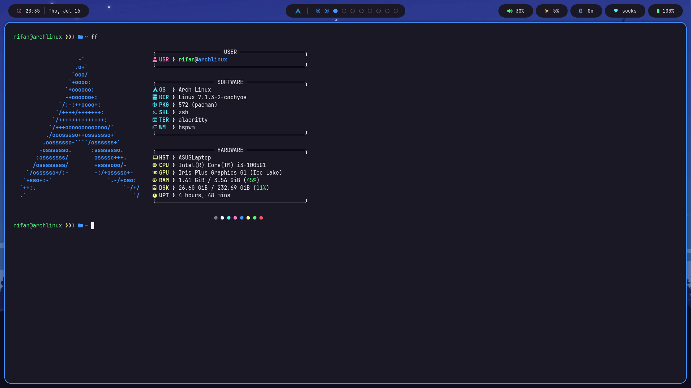

# My BSPWM Dotfiles

## Preview



## Requirements
- Alacritty
- Dunst
- Fastfetch
- Picom
- Polybar
- Rofi
- Sxhkd
- Zsh

## Install
### Install Requirements
```bash
sudo pacman -S alacritty dunst fastfetch picom polybar rofi sxhkd zsh
```
### Clone
```bash
git clone https://github.com/Rifanism/doftiles
```
### Copy
```bash
cp ~/dotfiles/* ~/.config
```
### Make ~/.xinitrc
```bash
sxhkd &
exec bspwm
```
### Run
```bash
super + alt + r (bspwm)
or
reboot
```

## Structure
```bash
.config/
├── alacritty
│   └── alacritty.toml
├── bspwm
│   └── bspwmrc
├── dunst
│   └── dunstrc
├── fastfetch
│   └── config.jsonc
├── picom
│   └── picom.conf
├── polybar
│   ├── config.ini
│   └── launch.sh
├── rofi
│   ├── config.rasi
│   ├── powermenu.sh
│   ├── rofi-bluetooth.sh
│   └── rofi-wifi.sh
├── sxhkd
│    └── sxhkdrc
└── zsh
     └── .zshrc
```

---
If it's error on yours, idk, do it yourself.
